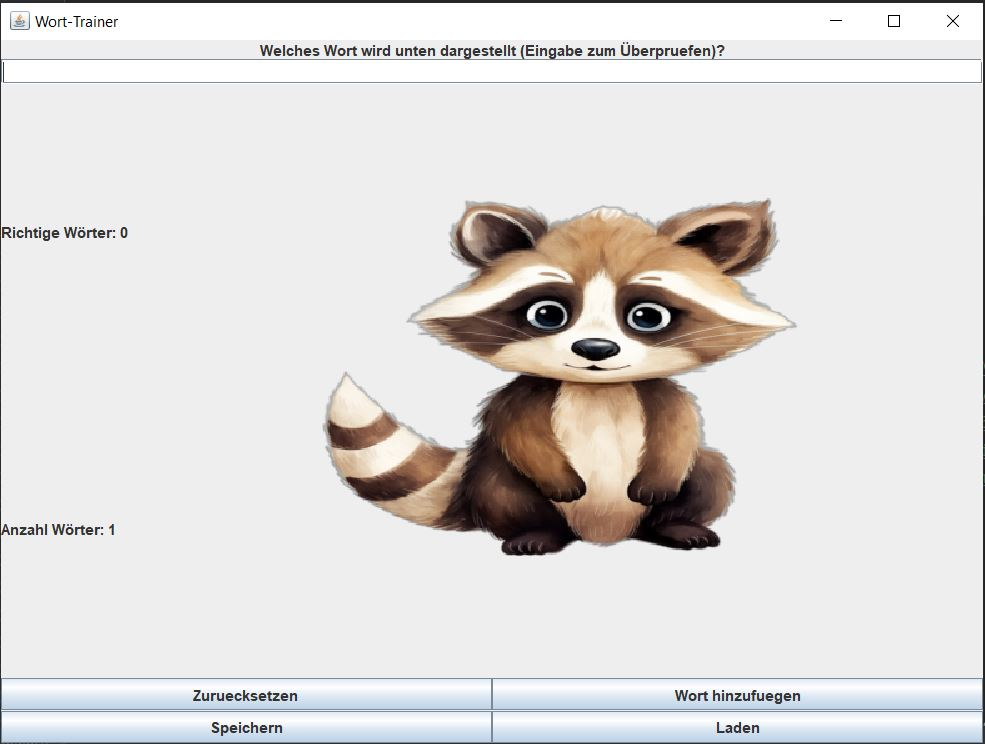

# 📜 Worttrainer-Projekt

Dieses Projekt ist ein **Rechtschreibtrainer**, der spielerisch das Lernen von Wörtern ermöglicht. Zu jedem angezeigten Bild soll das passende Wort eingegeben werden. Die Eingaben werden überprüft und **Statistiken** erfasst.

---

## 🚀 **Projektbeschreibung**

- Der Worttrainer zeigt ein **Bild** an (z. B. eines Tieres oder eines Gegenstandes).
- Die Kinder tippen das passende **Wort** ein.
- Die Eingabe wird mit der richtigen Schreibweise verglichen.
- Eine **Rückmeldung** wird gegeben:
  - ✅ **Richtig** → Ein neues Bild erscheint.
  - ❌ **Falsch** → Eine Rückmeldung erscheint, und das Kind darf es erneut versuchen.
- Das Programm erfasst und zeigt die folgenden **Statistiken**:
  - Anzahl der insgesamt geratenen Wörter
  - Anzahl der richtigen Eingaben
  - Anzahl der Versuche

---

## 🛠️ **Technische Details**

- **Programmiersprache**: Java 17
- **Build-Tool**: Gradle
- **GUI**: Swing (`JOptionPane` und `JFrame`)
- **Persistenz**: Speicherung der Fortschritte in **JSON**-Dateien (weitere Speicheroptionen wie XML oder SQLite sind möglich).

---
## 🖼 **Beispielansicht**

Hier ist eine Beispielansicht des Programms:



---

## 💻 **Wie starte ich das Projekt?**

1. **Voraussetzungen**:
  - Java 17 oder höher installiert
  - Gradle installiert (optional: Gradle Wrapper nutzen)

2. **Projekt ausführen**:
  - Klone das Repository mit `git clone <repository-url>`
  - Navigiere in das Projektverzeichnis und führe folgenden Befehl aus:
    ```bash
    ./gradlew run
    ```
  - Alternativ kannst du die `App`-Klasse direkt in deiner IDE ausführen.

---

## 🤑 **Funktionalitäten des Programms**

1. **Wörter und Bilder hinzufügen**:
  - Neue Wörter und zugehörige Bilder können durch die Option *"Wort hinzufügen"* ergänzt werden.
  - Dabei wird geprüft, ob eine gültige **URL** für das Bild angegeben wurde.

2. **Speichern und Laden**:
  - Der Fortschritt (z. B. Anzahl der richtigen Wörter) kann gespeichert und geladen werden.

3. **Statistiken anzeigen**:
  - Echtzeit-Anzeige der **richtigen Wörter** und **Anzahl der Versuche**.

4. **Wörter überprüfen**:
  - Die Eingaben werden normalisiert (Sonderzeichen werden berücksichtigt).

5. **Zufällige Wortauswahl**:
  - Nach jeder Eingabe wird ein neues Wort zufällig ausgewählt.

---

## ℹ️ **Anwenderhinweise**

- Stelle sicher, dass die Bild-URLs gültig sind und von einer zugänglichen Quelle stammen.
- Für die korrekte Anzeige der Bilder ist eine **stabile Internetverbindung** erforderlich.
- Bei falschen Eingaben erhält der Anwender hilfreiche Rückmeldungen zur weiteren Übung.

---

### 🎉 **Viel Spaß beim Lernen mit dem Worttrainer!**
